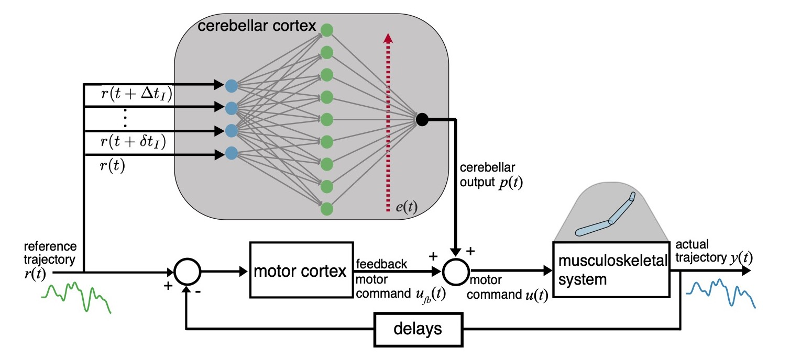

# Cerebellar Motor Learning



This is a simple implementation of the motor control system above. A feedforward (cerebellar cortex) and feedback system (motor cortex) control a plant (musculoskeletal system). The task is for the output of the plant $y(t)$ to match a reference trajectory $r(t)$. 
The cerebellar cortex module can adapt its weights online, while controlling the plant, to improve its internal model of the plant. 

The main goal is to evaluate learning performance for different network architectures of the cerebellar cortex module. We test different learning rules for the weights of the cerebellar-like network. 

It is 'plug and play' in the sense that you can create, swap, and connect components easily. You can implement different forms of plants, reference trajectories, and controllers. 
It's pretty easy to create your own components by adding to the `types.jl` and  `systemComponents_functions.jl` page.

The default implementations are as follows:
  - reference trajectory is a sum of sinusoidals with different frequencies (band limited) and phase shifts. 
  - motor cortex is a PID controller
  - cerebellar cortex is a feedforward neural network with one hidden layer with tanh activation function and a single linear output. The input weights are static and the output weights are adaptable. 
  - the musculoskeletal system is a linear plant. 

To get started we recommend going over the notebook `notebooks/LMS_test.ipynb`. 

<!-- ## Demo-Preview -->

<!-- ## Installation 
To use this project, first clone the repo on your device using the commands below:
 -->


## Running
The whole project is implemented in [Julia](https://docs.julialang.org/en/v1/). Julia allows for rapid calculation of gradients through the whole dynamic system. 

This is project is an 'unregistered package'. To run the project

1. Download [Julia 1.6](https://julialang.org/downloads/#long_term_support_release). Note that there might be compatibility problems to run the code in newer Julia versions. 
2. cd to the folder where you want to clone the project.
3. clone the repo on your device
```
git init
git clone ....... 
```

4. Open a Julia terminal. 
   
   1. **On VSCode** The easiest is to install the [Julia client](https://github.com/julia-vscode/julia-vscode#installing-juliavs-codevs-code-julia-extension) in [VSCode](https://code.visualstudio.com/Download).
   2. You can also just use a normal terminal. In the latter case, make sure you add and use Revise.jl before doing anything else. 
      ```
      ]
      add Revise
      ```

3. Running the code. There are multiple ways to run the code. 
Remember that in Julia, the first time you use a package it takes a really long time in Julia (compiling). Same for functions and plotting. But the second time is really quick.

### Running notebooks .ipynb
To run notebooks found in `notebooks/` folder.

#### With VSCode

1. Open VSCode
2. Add the [Jupyter extension to VSCode](https://marketplace.visualstudio.com/items?itemName=ms-toolsai.jupyter).
3.  Open the project folder `CerebellarMotorLearning`  
4.  Open one of the .ipynb in `notebooks/`
5.  Select the `Julia-1.6` kernel
6.  You can now run the cells 

#### On a terminal
1. Go to the project folder `CerebellarMotorLearning` 
2. Open a julia terminal by typing `julia` or `julia-1.6`
2. Install [IJulia](https://github.com/JuliaLang/IJulia.jl#quick-start) 
    ``` 
    ] 
    add IJulia
    ```
3. If you already have Python/Jupyter installed on your machine, you can then launch the notebook server the usual way by running `jupyter notebook` in the terminal. otherwise type the following on the Julia terminal
      ```
      using IJulia
      notebook()  
      ```

<!-- Add Pluto package
```
]
add Pluto
```

Run Pluto 
```
using Pluto 
Pluto.run()
``` -->

### Running scripts 

#### In VSCode
In VSCode you can directly open one of the scripts and run `Julia:Execute active File in new REPL`
  
#### In Julia terminal
In a julia terminal, ']' switches to the package manager, and ';' switches to the shell. If you switch to the package manager and write
```
]
activate . 
update
```
then you install and activate the environment for this package. Then type:
```
using CerebellarMotorLearning 
```
This might take a while as it is precompiling the whole package. But it will speed up running times later. 
Then switch to shell (with `;`), and `cd` to the scripts. Again, you can activate the environment in that folder, with
```
activate .
update
```

At this point you can type
`include("xxx.jl")` to run a script.
Simultaneously, (thanks to Revise.jl), you can alter functions and code in the FeedbackLearning package, and that will immediately be reflected in your code that calls it. 


## Scripts

### Helper functions
- `sizeSim_functions.jl`: functions to simulate different network sizes.
    - functions to build expanded systems with size N given original network with some parameters 
    - function build_systems_sim returns systems with different net sizes given by Ns with random seed randomSeed
    - function build_systems_sim_K:  build all the systems with sizes Ns and input sparsity Kss but same ref, plant... keep same W for different K. expand W with zeros for different N. returns vector of vector of systems with length(Kss)xlength(Ns) 
    - function build_systems_sim_K_KNconst: same as above but keeping the number of input connections to Kss[end]*N (i.e. to the largest size)
    - plotting functions
    - helper functions

### First round of simulations
- `hiddenLayerAna_*` : scripts to explore the statistics of the hidden layer (granule cell layer). Vary the indegree K and the number of granule cells N. Measure: dimensions, population sparsity, total variance, population correlation, newDimension (value of interest for our model) and mean of norm squared of activity vector. For input activity $m(t)$ and hidden layer activity $h(t)$ at each training times. Only builds "input system" i.e. the reference trajectory and cerebellar network. doens't care about the whole motor control system. 

- `LMS.jl`: test how LMSTrain works 

- `minimalExample.jl`: test system, training and post analysis

- `ss-learningSpeed_tradeoff.jl`: Plot learning speed and steady state loss as a function of learning step 

- `test_Asssumptions.jl`: Test assumptions of the analysis: change in error, hessian projection bounds, optimal network size

- `test_HessianAnalysis.jl`: Plot values of hessian projections of gradient, online gradient and information noise

- `test_LearningPerformance.jl`: Test learning performance for two different sized systems

- `test_LocalTaskDifficulty.jl`: Test local task difficulty (expected change in error) for different parameters and compare

### Newer simulations with DrWatson
- `test_theory_deltaTe.jl`:


## Plots folder
`./plots/` contains folders for different types of simulations with figures for newer scripts with Dr Watson. 

- `theoreticalCurves/` figures from the script `theoreticalCurves.jl` creates steady state loss vs learning speed figures for different sized networks computed using the theoretical equations for learning speed and local task difficulty as a function of network size and the parameters in the original network. 

- `lms_size_perf_N1_N2/` figures from the script `testSize_static_lp_simulate.jl` and `testSize_static_lp_analyse.jl`. Train small network with lms and use the weights trajectory of the small net to generate weights in expanded net. That way all networks have the same task loss throughout learning. Measure the learning parameters (grad norms, correlation, hessian proj, static (i.e. theoretical) learning speed and local task difficulty). Plot all of the above including theoretical ls vs ssl as a function of the net expansion 
  - we seem to find all as expected except that local task difficulty increases with network expansion 

-`test_theory_deltaTr_/` figures from `test_theory_deltaTr.jl`. Learning parameters from weight updates for different reaction delays deltaTr. The weight trajectory is the same each time, just compute the different weight updates

-`test_theory_deltaTe_/` figures from `test_theory_deltaTe.jl`. Learning parameters from weight updates for different error delays deltaTe. The weight trajectory is the same each time, just compute the different weight updates

-`test_theory_gamma_/` figures from `test_theory_gamma.jl`. Learning parameters from weight updates for different learning rule noise strength $\eta^{lr}$. The weight trajectory is the same each time, just compute the different weight updates

- `lms_size_Ls-ss_/` figures from `testSize_static_Ls-SS_analyse.jl` and `testSize_static_Ls-SS_simulate.jl`. Learning speed and steady state loss when varying network size and learning step as trained with lms 


### Notes on simulations and parameters
Simulation of lms for different net sizes and learning steps. The files in question are
`testSize_static_Ls-SS_simulate.jl` and `testSize_static_Ls-SSssFromMin_simulate.jl`. 
Initially for convenience we had a fixed interval of learning steps used for each network size. However, the optimal range of learning step depends on network size. Hence, the fixed ranged meant that the smaller nets in the lower end of the range learned very slowly and the larger nets in the higher end had the danger of not learning. 

We introduce in `testSize_static_Ls-SSssFromMin_simulate.jl`, variable range of learning steps musVar for different net sizes. `muScale =0.3` sets the scaling of the learning steps as function of network expansion $\gamma(q) = \gamma(1)/q^0.3$. 

The second issue we were encountering was that for small learning steps, the steady state loss didn't converge to 0. This means that the ss vs learning speed plot had the shape of rotated u with a minimum ss rather than just monotonic increase with ss or upside down parabola. 

We believe this was happening because for small learning step, network didn't have time to converge to the minimum and got stuck in plateaus. The solution to this is calculating ss by computing task loss for initial weights near the minimum. 


If we don't see the tradeoffs we expect it is possible that it is because the lms learning with the chosen parameters has very little online learning error of learning rule error. 
We can increase $\Delta t_r$ and the gap between $\Delta t_h$ to introduce errors in the learning rule through delays. 
## Performance tips

- Only compatible with v1.6. Earlier versions raise errors with Modelingtoolkit.jl and with jld2 loading variables.
- Important to keep Flux under v0.12.9. Newer versions raise error with Flux.destructure() and ModellingToolkit.jl

<!-- - ways to improve speed of training: 
    - main time comes from precompiling the solve(probSens,callbacks). i.e. building jacobian etc of the sytem. if we were to run solve again for the same system, it would take 10% of the time
    - some extra time 5s or so from making callbacks for certain updates. again this is a matter of precompilation. could we make updates for all the systems (i.e. reuse for larger sizes)? this would be hard as the update of weights line depends on the size of the network N and this changes for each system. 
    - if I run train() multiple times in a row it recompiles each time, whereas if I run the functions inside train multiple times it doesn't need to recompile. why? 
    - runtime for train doesn't depend too much on the trajectory time, more on the size of the net N. (16s frp N=10 but 336s for N=50)
    - even if we don't have updates (i.e. no callbacks) sol times still takes a lot of time to compute for large Ns (119s for N=50 no updates). ODEprob takes fraction of the time for large nets (4.5s for N=50) -->
    